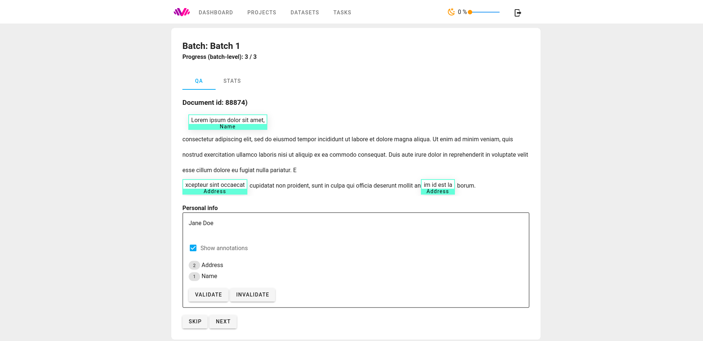
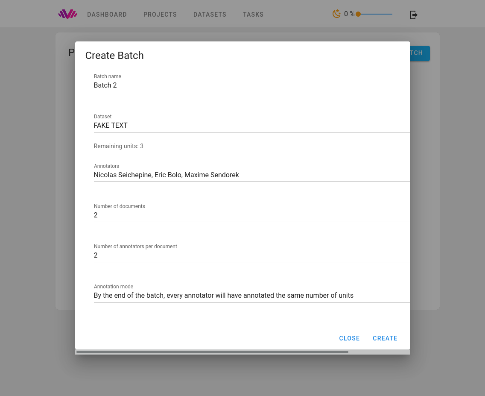

## Labelit

Labelit is an extensible web-based annotation tool currently supporting:

- Text and audio annotation (summative)
- Categorical, ordinal classification
- Transcription
- Named entity annotation (highlighting and labeling)
- Text edition (correction, punctuation, etc.)
- Audio region segmentation

The tool comes with utilities for distributing work across multiple annotators,
monitoring progress and (where applicable) annotator agreement, Quality Assurance (QA)
 and managing datasets.

Multiple annotation tasks (e.g. classification + transcription) can be combined
in a single project

Labelit is designed for extensibility: new annotation tasks / schemas
can be created by contributors, while retaining generic features.

### Demo

https://labelit.demo.hosting.call.watch
annotator account: username: demo@demo.com, password: dem0#nnotator
QA account: username: qa@qa.com, password: demo

### Documentation

We use `mkdocs` to maintain our documentation.
The documentation (currently, only boilerplate) is hosted on [readthedocs.org](https://labelit.readthedocs.io/en/latest/)

#### Documentation editing

To edit the documentation, first install the same `mkdocs` version that readthedocs will use
during automatic building.

`pip install -r requirements-local.txt`

Then:

`mkdocs serve`

The documentation will be available locally at `127.0.0.1:8000` with live reloading as you edit the documentation.

#### Documentation building

The build is handled by ReadTheDocs. 

Building must be triggered manually from readthedocs (Projects > Labelit) by clicking the "Build version" button
in the overview tab.

You *must* be added as a maintainer on readthedocs in order to view the project
and launch the build and publication.

By default, the latest version of the master branch is used as a starting point for building.

### Overview

Entity annotation (WIP) in labelit in QA mode. Annotations can be validated or sent for review:

Annotation on labelit is divided into projects. Each project defines a set of annotation tasks and is further 
divided into batches. The following screenshot shows the creation of a batch. Labelit
enables annotation managers to configure for each batch: which data to annotate and how much, the number of participants,
the number of annotators per document and how the documents are distributed among annotators (even or possibly varying
number of documents across annotators)

Generic and task-specific information and statistics are provided for each batch.
For some tasks, agreement and other quality metrics are automatically computed.

The global dashboard (WIP) provides a global overview of the work:

HTML instructions can be edited by annotation managers and enriched with images and links:

You are free to choose which tasks to combine in a project. Here, two ordinal tasks are combined, but different
types of tasks (ex. transcription + categorization) can also be combined. For each project you can specify if you want
audio, text or both to be annotated

