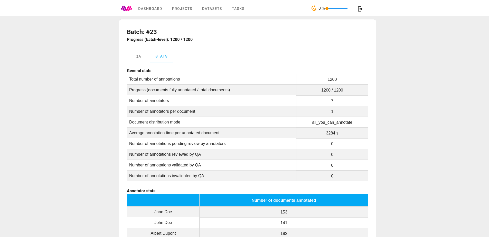
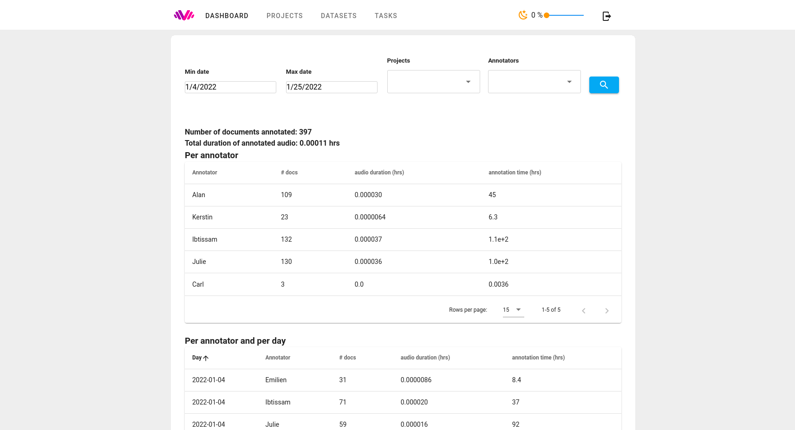
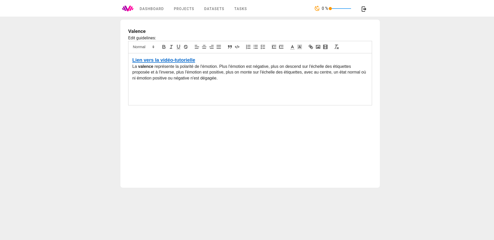
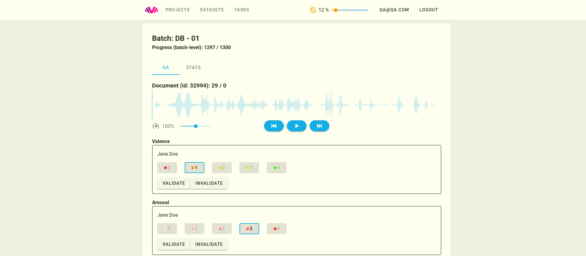

# Introduction

## What is Labelit ?

Labelit is an extensible web-based annotation tool currently supporting:

* Text and audio annotation (summative)
* Categorical, ordinal classification
* Transcription
* Named entity annotation (highlighting and labeling)
* Text edition (correction, punctuation, etc.)
* Audio region segmentation

The tool comes with utilities for distributing work across multiple annotators, monitoring progress and (where applicable) annotator agreement, Quality Assurance (QA) and managing datasets.

Multiple annotation tasks (e.g. classification + transcription) can be combined in a single project. (Tasks cannot yet be *nested*, but it's in the roadmap)

Labelit is designed for extensibility: new annotation tasks / schemas can be created by contributors, while retaining generic features.

## Demo application

A demo version of `LabelIt` is hosted at [https://labelit.demo.batvoice.ai](https://labelit.demo.batvoice.ai)
- Annotator account: 
  - Username: `demo@demo.com`
  - Password: `dem0#nnotator`
- QA account:
  - Username: `qa@qa.com`
  - Password: `demo`

## Supported installation types

Labelit supports several ways of installation:

- __Saas__: Send an email to [contact@batvoice.com](mailto:contact@batvoice.com)
- __Local__: Launch Labelit directly on your computer.
- __Self-hosted__: Self host labelit in a Kubernetes cluster thanks to the custom helm chart.

## Key features

Entity annotation (WIP) in labelit in QA mode. Annotations can be validated or sent for review:

Annotation on labelit is divided into projects. Each project defines a set of annotation tasks and is further divided into batches. The following screenshot shows the creation of a batch. Labelit enables annotation managers to configure for each batch: which data to annotate and how much, the number of participants, the number of annotators per document and how the documents are distributed among annotators (even or possibly varying number of documents across annotators)

Generic and task-specific information and statistics are provided for each batch. For some tasks, agreement and other quality metrics are automatically computed.

The global dashboard (WIP) provides a global overview of the work:

HTML instructions can be edited by annotation managers and enriched with images and links:

You are free to choose which tasks to combine in a project. Here, two ordinal tasks are combined, but different types of tasks (ex. transcription + categorization) can also be combined. For each project you can specify if you want audio, text or both to be annotated

